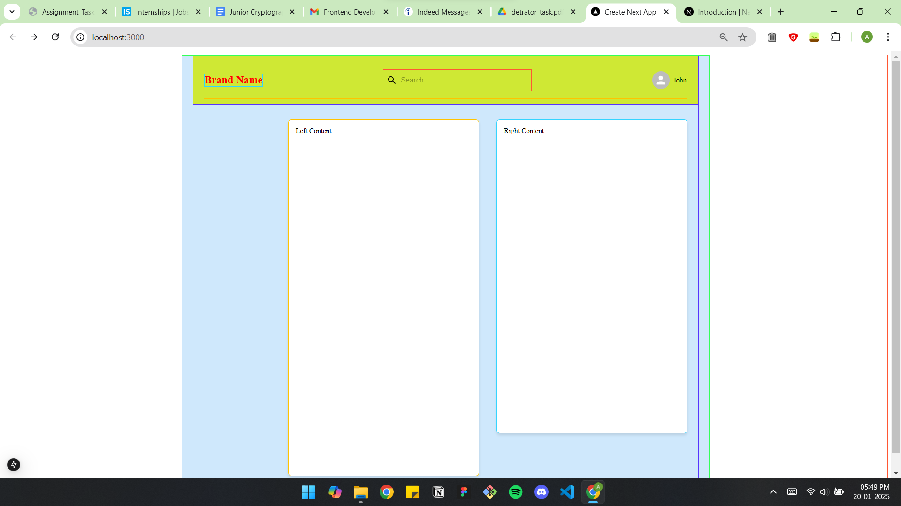
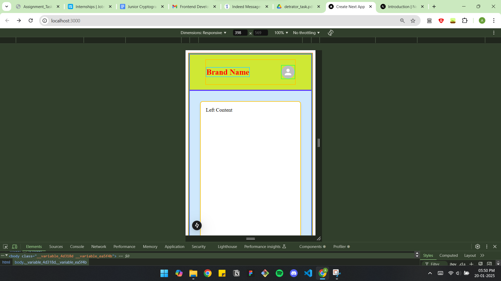

# Responsive UI with Material-UI

This project is a responsive user interface built with Material-UI and React. It includes dynamic layouts that adapt to different screen sizes using Material-UI's `sx` prop with media queries.

## Features

### Header Section
- **Brand Name**: Displays the brand name prominently on all screens.
- **Search Bar**: Visible on larger screens, hidden on screens smaller than 600px.
- **User Section**: Includes an avatar and a name. On smaller screens, the name is hidden, but the avatar remains visible.

### Main Content Section
- **Left Box**: The left content box adjusts dynamically:
  - Has a margin (`ml`) of `12rem` on larger screens.
  - Margin is removed (`ml: 0`) on smaller screens.
- **Right Box**: Visible on larger screens, completely hidden on smaller screens.

## Technology Stack
- **React**: For building the user interface.
- **Material-UI**: For styling and responsive design.

## Installation and Setup
1. Clone this repository:
   ```bash
   git clone <repository-url>
   ```

2. Navigate to the project directory:
   ```bash
   cd <project-directory>
   ```

3. Install dependencies:
   ```bash
   npm install
   ```

4. Start the development server:
   ```bash
   npm run dev
   ```

## File Structure
- **Header Section**:
  - Contains the brand name, search bar, and user section.
  - Uses `Stack` for layout and `Box` for styling.
- **Main Content Section**:
  - Divided into a left and right column.
  - Each column has its own responsive styling.

## Media Query Behavior
- **Search Bar**:
  - Hidden on screens smaller than 600px.
- **User Name**:
  - Hidden on screens smaller than 600px, but the avatar remains visible.
- **Left Box**:
  - Removes extra margin (`ml: 0`) on screens smaller than 600px.
- **Right Box**:
  - Hidden on screens smaller than 600px.

## Dependencies
- **React**: `^18.x`
- **Material-UI**:
  - Core: `@mui/material`
  - System: `@mui/system`
  - Icons: `@mui/icons-material`

## How to Customize
- Modify the `sx` prop in the code to adjust styles.
- Update media query breakpoints (e.g., `600px`) as needed.

## Screenshots
Add screenshots here to illustrate the responsive behavior of your UI.



## License
This project is licensed under the MIT License.

---

### Author
Created by Ankit.
